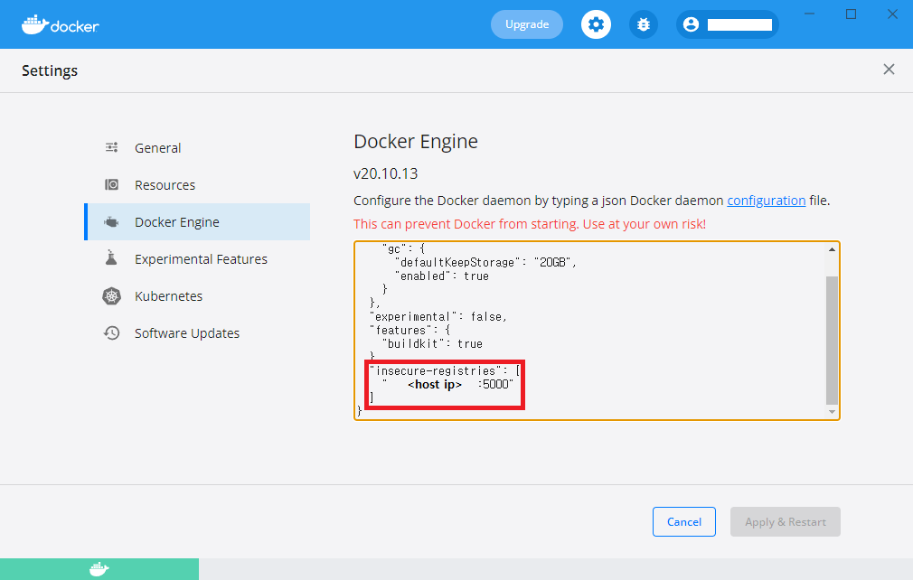

# private registry

로컬 registry를 구축해 보는 튜토리얼

<br/>

### 1. pull and run local registry (host)

```
docker pull registry:latest

docker run -d -p 5000:5000 --name local-registry registry:latest
```

#### 추가적인 옵션

- **--restart=always** : container가 다운 되더라도 재시작한다.
- **-v /data/registry:/var/lib/registry/Docker/registry/v2** : container가 종료 되더라도 이미지 데이터를 보존하기 위해 volume을 mount한다.

```
docker run -d --restart=always -p 5000:5000 -v /data/registry:/var/lib/registry/Docker/registry/v2 --name local-registry registry:latest
```

<br/><br/>

### 2. push image to registry (client)

docker-jupyter라는 이미지를 **push** 한다.

```
docker tag docker-jupyter:latest <host ip>:5000/docker-jupyter

docker push <host ip>:5000/docker-jupyter
```

- `<host ip>`에는 local registry의 서버 ip를 의미한다.

<br/>

`Get https://<host ip>:5000/v2/: http: server gave HTTP response to HTTPS client`라는 error가 발생한다면?

<br/>

- `<windows OS>`
  Docker Desktop에서 아래와 같이 `"insecure-registries": ["<host ip>:5000"]`를 추가하고 Docker를 재시작한다.
  

<br/>

- `<linux OS>`
  `/etc/docker/daemon.json`에 아래 내용을 추가 후 Docker를 재시작한다. (만약 파일이 없다면 생성한다.) <br/>

```
{
    "insecure-registries": ["<host ip>:5000"]
}
```

<br/><br/>

### 3. pull image from registry (client)

private registry에서 docker-jupyter 이미지를 **pull** 한다.

```
docker pull <host ip>:5000/docker-jupyter
```

<br/><br/>

### 4. image ls (client)

private registry에 저장되어 있는 **이미지 목록을 조회**한다.

```bash
~$ curl -X GET <host ip>:5000/v2/_catalog
```
```shell
PS> curl -method get <host ip>:5000/v2/_catalog
```
